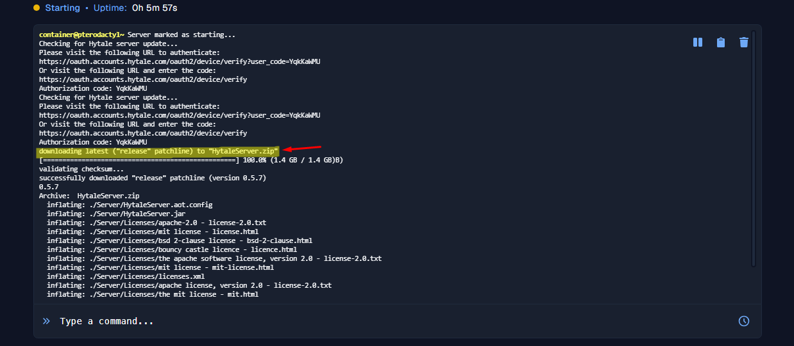
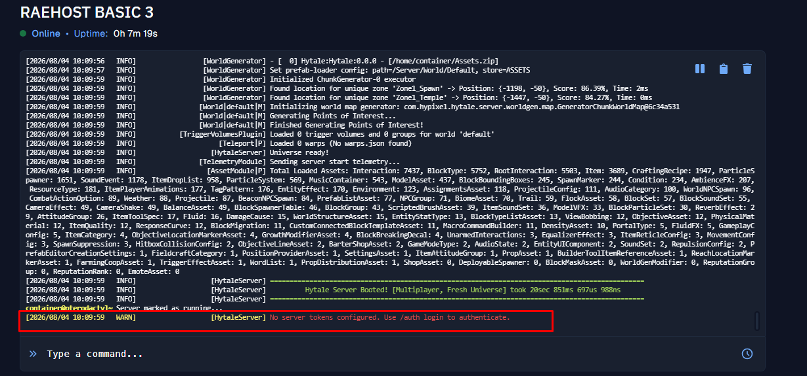
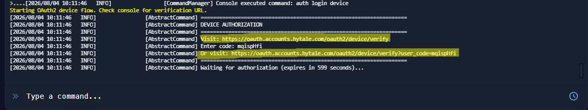
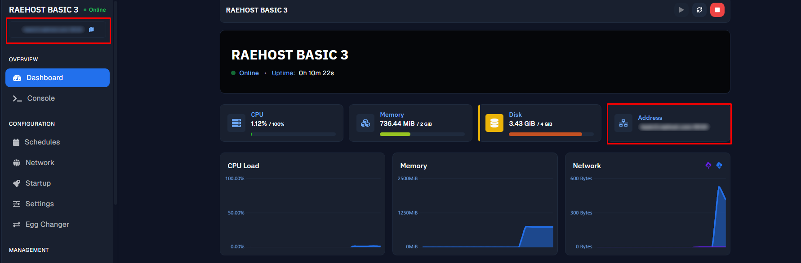

<Steps>
  <Step title="Pastikan Server Stop">
    Untuk melakukan ini, kamu perlu login ke panel melalui [https://panel.raehost.com/](https://panel.raehost.com/). Kemudian pilih servermu, dan pastikan statusnya `Offline`. Jika server masih menyala, klik tombol `Stop` terlebih dahulu sebelum lanjut ke langkah berikutnya.
  </Step>
  <Step title="Buka Egg Changer">
    Pada sidebar server, klik menu `Egg Changer`. Kamu akan melihat daftar `Nests` beserta jumlah egg di masing-masing kategori.

    Cari nest `Hytale`, lalu klik tombol `Browse` pada kartu tersebut.

    <Frame>
      
    </Frame>
  </Step>
  <Step title="Pilih Egg Hytale">
    Setelah masuk ke nest `Hytale`, kamu akan melihat egg `Hytale` beserta deskripsinya. Klik tombol `Select` untuk memilih egg tersebut.

    <Frame>
      
    </Frame>
  </Step>
  <Step title="Konfirmasi Ganti Egg">
    Akan muncul modal `Change Server Egg`. Pastikan kedua opsi berikut sudah tercentang:

    - **Reinstall Server** — server akan diinstal ulang menggunakan installation script dari egg baru (Hytale), sehingga proses instalasi Hytale langsung berjalan setelah egg diganti.
    - **Clear All Files** — seluruh file dan folder pada root server akan dihapus saat proses penggantian egg. Opsi ini penting dicentang agar tidak ada sisa file dari egg sebelumnya yang bisa mengganggu instalasi Hytale.

    <Frame>
      
    </Frame>

    Setelah kedua opsi dicentang, klik tombol `Confirm Change`.
  </Step>
  <Step title="Tunggu Instalasi Selesai">
    Panel akan otomatis membersihkan file lama dan menjalankan proses instalasi egg Hytale. Tunggu hingga proses instalasi selesai (ditandai status server kembali `Offline`/`Installed` di tab `Console`), lalu klik tombol `Start`.
  </Step>
  <Step title="Lakukan Autentikasi">
    Untuk server Hytale, akan muncul link autentikasi pada console. Silahkan klik link tersebut.

    <Frame>
      
    </Frame>
  </Step>
  <Step title="Autentikasi Akun Melalui Hytale">
    Klik tombol `Approve` seperti dibawah ini.

    <Frame>
      
    </Frame>

    Kemudian klik Login menggunakan Google

    <Frame>
      
    </Frame>

    Akun akan terverifikasi, seperti berikut

    <Frame>
      
    </Frame>
  </Step>
  <Step title="Kembali ke Panel ">
    Masuk kembali ke tab `Console`, server sedang dibuat dengan ditandai seperti ini

    <Frame>
      
      
    </Frame>
  </Step>
  <Step title="Masukkan token">
    Selanjutnya server akan running seperti nomor 1. Kemudian akan muncul pemberitahuan seperti nomor 2.

    <Frame>
      
      
    </Frame>

    Pada console, tulis command ini dan kirim

    ```text
    auth login device
    ```
  </Step>
  <Step title="Server Harus di Verifikasi lagi">
    <Frame>
      
      
    </Frame>

    Akan muncul link verifikasi seperti gambar diatas. Bisa klik link 1 atau 2. Sarannya, klik saja link nomor 2. Kemudian ikuti step 6.
  </Step>
  <Step title="Cek Status">
    Jika sudah berhasil diverifikasi, bisa tulis di console

    ```text
    auth status
    ```

    Akan muncul informasi pengguna di tab `Console`
  </Step>
  <Step title="Copy Server Address">
    <Frame>
      
      
    </Frame>
  </Step>
  <Step title="Buka Hytale ">
    Klik menu `Servers` seperti gambar dibawah ini:

    <Frame>
      
    </Frame>
  </Step>
  <Step title="Klik Add Server">
    <Frame>
      
    </Frame>
  </Step>
  <Step title="Masukkan Server Address">
    Isi informasi yang dibutuhkan

    <Frame>
      
    </Frame>

    1. Isi `connection address` dengan server address yang sudah di copy pada tab `Console`
    2. Masukkan nama server yang kamu inginkan
    3. Klik tombol `Add Server`
  </Step>
  <Step title="Server Terbuat">
    Kamu bisa klik server yang sudah terbuat seperti ini

    <Frame>
      
    </Frame>
  </Step>
</Steps>