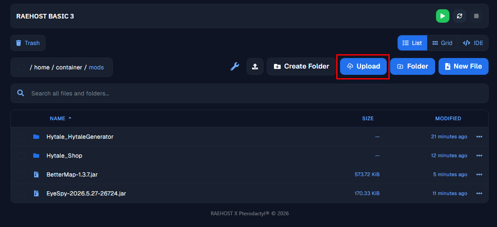

Pilih metode pemasangan mod yang ingin kamu gunakan:

<CardGroup cols={2}>
  <Card title="Lewat Panel" icon="browser" href="#panel">
    Install mod langsung dari menu Hytale Mods di panel, tanpa perlu download & upload manual.
  </Card>

  <Card title="Manual" icon="folder" href="#manual">
    Download mod dari web pihak ketiga (contoh: CurseForge), lalu upload ke folder `mods` di panel.
  </Card>
</CardGroup>

## Panel

<Steps>
  <Step title="Pastikan Server Mati">
    Login ke panel melalui [https://panel.raehost.com/](https://panel.raehost.com/), lalu pastikan servermu dalam status `Offline`. Setelah itu, buka menu `Hytale Mods` pada sidebar.

    <Frame>
      
    </Frame>
  </Step>
  <Step title="Pilih Mod">
    Cari mod yang ingin kamu gunakan, lalu klik tombol `Install` pada mod tersebut.

    <Frame>
      
    </Frame>
  </Step>
  <Step title="Pilih Versi Mod">
    Akan muncul pop up untuk memilih versi mod yang ingin digunakan. Disarankan untuk memilih versi yang paling atas/terbaru, lalu klik tombol `INSTALL`.

    <Frame>
      
    </Frame>
  </Step>
  <Step title="Tunggu Proses Instalasi">
    Tunggu hingga muncul notifikasi `Successfully installed <Nama Mod>` yang menandakan mod sudah berhasil terinstall. Mod yang sudah terinstall bisa dicek pada tab `Installed`.

    <Frame>
      
    </Frame>
  </Step>
  <Step title="Start Server">
    Setelah mod berhasil terinstall, kembali ke tab `Console` dan klik tombol `Start` untuk menjalankan server.

    <Frame>
      
    </Frame>
  </Step>
</Steps>

## Manual

<Steps>
  <Step title="Login ke Panel">
    Untuk melakukan ini, kamu perlu login ke panel melalui [https://panel.raehost.com/](https://panel.raehost.com/). Kemudian pilih servermu, dan pastikan statusnya `Offline`. Jika server masih menyala, klik tombol `Stop` terlebih dahulu sebelum lanjut ke langkah berikutnya.
  </Step>
  <Step title="Download Mod">
    <Steps>
      <Step title="Masuk ke Web Pilihanmu">
        <Info>
          Contoh: [https://www.curseforge.com/](https://www.curseforge.com/)
        </Info>

        Setelah masuk ke web nya, cari Hytale

        <Frame>
          
        </Frame>
      </Step>
      <Step title="Pilih Kategori">
        Pilih `Mod` pada kategori

        <Frame>
          
        </Frame>
      </Step>
      <Step title="Cari Mod">
        Cari Mod yang kamu inginkan

        <Frame>
          
        </Frame>
      </Step>
      <Step title="Download File">
        <Frame>
          
        </Frame>

        1. Klik Mod yang kamu ingin seperti berikut
        2. Plih tab `Files`
        3. Klik icon detail
        4. Klik menu `Download File`. Tunggu hingga file terdownload sempurna.
      </Step>
    </Steps>
  </Step>
  <Step title="Upload File">
    Kembali ke [https://panel.raehost.com/](https://panel.raehost.com/) dan masuk ke tab `Files`. Kemudian klik folder `mods` seperti berikut:

    <Frame>
      
    </Frame>

    Upload fils yang sudah di download dengan cara di drag and drop atau klik tombol `Upload` seperti yang ditunjuk oleh nomor 1. Setelahnya file akan tersimpan di `File Manager` seperti nomor 2.

    <Frame>
      
      
    </Frame>
  </Step>
  <Step title="Start Server">
    Klik tombol `Start` pada tab `Console`

    <Frame>
      
    </Frame>
  </Step>
</Steps>

<iframe src="https://www.youtube.com/embed/qT5v0TifxW0" title="YouTube video player" frameborder="0" className="w-full aspect-video rounded-xl" allow="accelerometer; autoplay; clipboard-write; encrypted-media; gyroscope; picture-in-picture; web-share" allowfullscreen />

\\